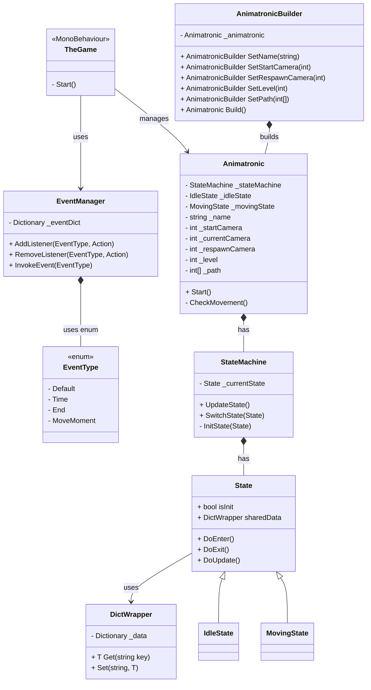

# DesPat

```mermaid
classDiagram

class TheGame {
  <<MonoBehaviour>>
  - Start()
}

class StateMachine {
  - State _currentState
  + UpdateState()
  + SwitchState(State)
  - InitState(State)
}

class State {
  + bool isInit
  + DictWrapper sharedData
  + DoEnter()
  + DoExit()
  + DoUpdate()
}

class IdleState
class MovingState

class DictWrapper {
  - Dictionary<string, object> _data
  + T Get<T>(string key)
  + Set<T>(string, T)
}

class EventManager {
  - Dictionary<EventType, Action> _eventDict
  + AddListener(EventType, Action)
  + RemoveListener(EventType, Action)
  + InvokeEvent(EventType)
}

class EventType {
  <<enum>>
  - Default
  - Time
  - End
  - MoveMoment
}

class Animatronic {
  - StateMachine _stateMachine
  - IdleState _idleState
  - MovingState _movingState
  - string _name
  - int _startCamera
  - int _currentCamera
  - int _respawnCamera
  - int _level
  - int[] _path
  + Start()
  - CheckMovement()
}

class AnimatronicBuilder {
  - Animatronic _animatronic
  + AnimatronicBuilder SetName(string)
  + AnimatronicBuilder SetStartCamera(int)
  + AnimatronicBuilder SetRespawnCamera(int)
  + AnimatronicBuilder SetLevel(int)
  + AnimatronicBuilder SetPath(int[])
  + Animatronic Build()
}

TheGame --> EventManager : uses
TheGame --> Animatronic : manages

StateMachine *-- State : has
State --> DictWrapper : uses

State <|-- IdleState
State <|-- MovingState

Animatronic *-- StateMachine : has
AnimatronicBuilder *-- Animatronic : builds

EventManager *-- EventType : uses enum

```
